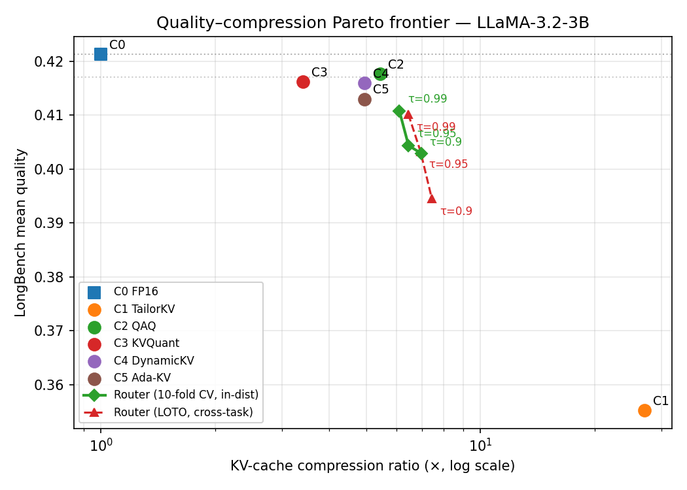
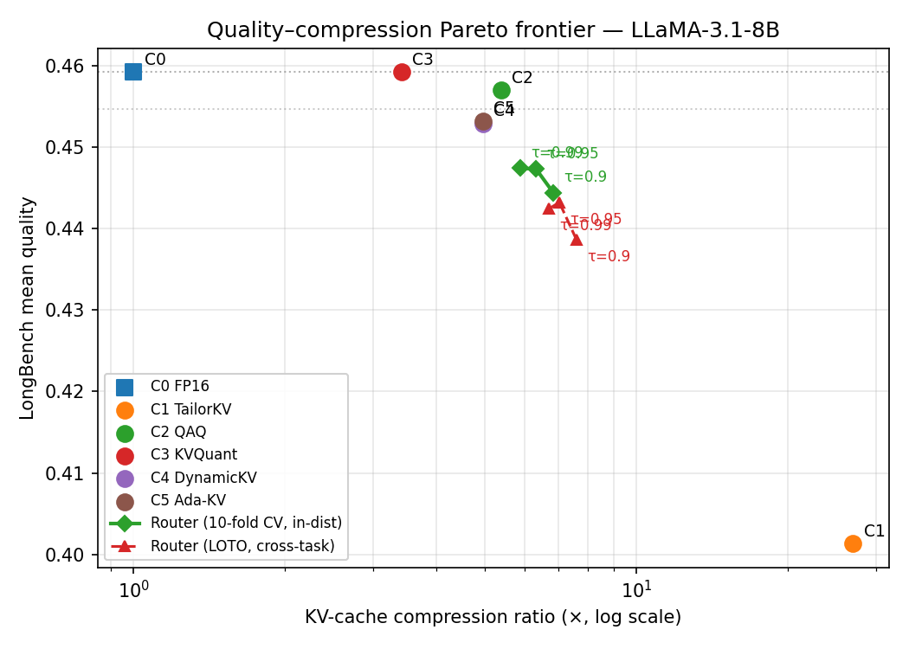

# AdaptiveServe-KV

**A per-prompt router that selects among five published KV-cache compression methods for cloud-native LLM serving.**

AdaptiveServe-KV stacks an outer per-prompt router on top of five existing KV-cache compressors (TailorKV, QAQ, KVQuant, DynamicKV, Ada-KV). The router uses cheap surface features extracted from the prompt string (microseconds, no model forward pass) to dispatch each request to the compression method best suited to it. On models where compression methods exhibit per-prompt quality variance, the router strictly Pareto-dominates every fixed compressor. On models where they don't, the router still produces a Pareto-frontier point — and we provide a calibration-time test (Δ) for which regime your workload is in.

| Headline (in-distribution, τ=0.99) | LLaMA-3-8B | Phi-3-mini |
|---|---:|---:|
| Router quality | **0.470** | **0.352** |
| Router compression | **6.54×** | **6.20×** |
| FP16 baseline quality | 0.445 | 0.317 |
| Quality gain over FP16 | **+5.6%** | **+11.0%** |
| Routing overhead | 64 µs / prompt | 64 µs / prompt |

This README is a quick-start for **integrators and reproducers**. The accompanying paper has the full method, ablation, and characterization.

---

## When does AdaptiveServe-KV help? (the deployment recipe)

The router pays off iff compression methods exhibit per-prompt quality variance on your workload. We quantify this with a single calibration-time number:

$$\Delta = \frac{\max_{c \in \{c_2, c_3, c_4, c_5\}} \overline{q}(c) - \min_{c \in \{c_2, c_3, c_4, c_5\}} \overline{q}(c)}{\overline{q}(c_0)}$$

where $\overline{q}(c)$ is the mean LongBench quality of compressor $c$ on your calibration data, and $c_0$ is FP16.

| Regime | Δ | What to deploy | Why |
|---|---|---|---|
| **High-spread** | ≥ 4% | The router | Strict Pareto win on Phi-3, LLaMA-3-8B |
| **Low-spread** | < 2% | Fixed conservative method (KVQuant) | Compressors converge; routing can't add value |

Below is the measured spread for each model we tested:

| Model | Δ (over c₂–c₅) | Router quality gap vs best fixed | Verdict |
|---|---:|---:|---|
| Phi-3-mini | 5.7% | **+7.0%** | ✅ deploy router |
| LLaMA-3-8B | 4.5% | **+4.7%** | ✅ deploy router |
| LLaMA-3.2-3B | 1.2% | −1.7% | use KVQuant |
| LLaMA-3.1-8B | 1.3% | −5.7% | use KVQuant |

---

## What is AdaptiveServe-KV (the two layers)

| Layer | What adapts | When it runs | What it sees |
|-------|-------------|--------------|--------------|
| **Inner adaptivity** (existing methods c₁–c₅) | per-token / per-head / per-layer / per-channel decisions *inside* one chosen compressor | during the model forward pass | model internals: attention scores, activations, query norms |
| **Outer adaptivity** (c⋆, this project) | *which* compressor to use | before any forward pass | prompt-only surface features (length, entropy, gzip ratio, …) |

The two layers compose. The router picks DynamicKV; DynamicKV still does its per-layer budgeting. The router picks TailorKV; TailorKV still does its hybrid quant-plus-prune logic. We are not replacing inner adaptivity — we are stacking on top of it. **Inter-method scheduling**, at ~64 µs CPU per request.

---

## Configurations

| ID | Method | Description |
|----|--------|-------------|
| **c₀** | FP16 Baseline | Full-precision KV cache. Quality yardstick; never selected by the router. |
| **c₁** | TailorKV | Hybrid: dense "quantization-friendly" layers (Q={0}) get 1-bit KIVI-style quantization; sparse layers get SnapKV-style retention (64 recent + 128 top-attention prefix tokens). Yao et al. 2025 — [arXiv:2505.19586](https://arxiv.org/abs/2505.19586). |
| **c₂** | QAQ Full | Attention-aware variable-bit quantization ([2, 16] bits), 1% outliers kept at FP16, attention window of 5. Two-pass prefill captures last-window attention without O(N²) memory. Dong et al. 2024 — [arXiv:2403.04643](https://arxiv.org/abs/2403.04643). |
| **c₃** | KVQuant | Per-channel K + per-token V uniform asymmetric quantization at 4 bits, with 1% FP16 magnitude outliers (Dense-and-Sparse). Hooper et al. 2024 — [arXiv:2401.18079](https://arxiv.org/abs/2401.18079). |
| **c₄** | DynamicKV | Per-layer attention-driven token retention. Each layer keeps top-K tokens by aggregated last-window attention. Zhou et al. 2024 — [arXiv:2412.14838](https://arxiv.org/abs/2412.14838). |
| **c₅** | Ada-KV | Head-wise adaptive budget allocation: per-layer pool = budget_per_head × n_kv_heads, split across heads proportional to per-head attention concentration. Feng et al. 2024 — [arXiv:2407.11550](https://arxiv.org/abs/2407.11550). |
| **c⋆** | AdaptiveServe-KV Router | Per-prompt feature-based regression router over {c₁..c₅}. 7 surface features → 6 `HistGradientBoostingRegressor`s → iso-quality dispatch. **This project's contribution.** |

---

## Models

| Alias | HuggingFace ID | Parameters | Context | Δ |
|-------|---------------|-----------:|---------:|---:|
| `phi3` | `microsoft/Phi-3-mini-4k-instruct` | 3.8 B | 4 k | 5.7% |
| `llama3` | `meta-llama/Meta-Llama-3-8B-Instruct` | 8 B | 8 k | 4.5% |
| `llama31_8b` | `meta-llama/Llama-3.1-8B-Instruct` | 8 B | 128 k | 1.3% |
| `llama32_3b` | `meta-llama/Llama-3.2-3B-Instruct` | 3 B | 128 k | 1.2% |

---

## Metrics

| Metric | Description |
|--------|-------------|
| **LongBench Avg** | Mean per-prompt score across 11 long-context tasks (range [0, 1], higher is better) |
| **KV Compression Ratio** | FP16 KV size / compressed KV size, computed per prompt and aggregated by harmonic mean |
| **τ (tau)** | User-supplied iso-quality tolerance. Router picks max-compression config s.t. predicted q ≥ τ × predicted q(c₀). Default: 0.99 |
| **Δ** | Compressor spread on your calibration data — see deployment recipe above |

### LongBench Tasks (11 × 20 prompts = 220)

| Task | Metric | Domain |
|------|--------|--------|
| NarrativeQA | F1 | Story comprehension |
| Qasper | F1 | Scientific QA |
| MultiFieldQA-en | F1 | Multi-domain QA |
| HotpotQA | F1 | Multi-hop reasoning |
| 2WikiMQA | F1 | Multi-hop reasoning |
| GovReport | ROUGE-1 | Long-form summarization |
| MultiNews | ROUGE-1 | Multi-document summarization |
| QMSum | ROUGE-1 | Query-based meeting summarization |
| PassageCount | EM | Counting |
| TREC | Accuracy | Question classification |
| TriviaQA | F1 | Open-domain QA |

---

## Test bench

All measurements come from a single workstation:

| Component | Value |
|---|---|
| GPU | NVIDIA GeForce RTX 3090 Ti (24 GiB VRAM, Ampere) |
| CPU | AMD Ryzen 9 9900X (12 cores / 24 threads) |
| RAM | 64 GiB DDR5 |
| OS | Linux 6.6.87 (WSL2 on Windows 11) |
| Python | 3.13.11 |
| PyTorch | 2.11.0 + CUDA 13.0 |
| transformers | 5.7.0 |
| scikit-learn | 1.8.0 (router only) |
| Precision | Models loaded in `bfloat16`; KV cache compressors operate at their declared bit widths (1–16 bit) |

---

## Results

### Fixed-method baselines (all four models)

220 LongBench prompts per model. Each cell shows LongBench-average quality / mean compression ratio. **Bold** marks the best quality and best compression on each model (excluding c₀).

| Config | Phi-3-mini | LLaMA-3-8B | LLaMA-3.2-3B | LLaMA-3.1-8B |
|---|---:|---:|---:|---:|
| c₀ (FP16) | 0.317 / 1.00× | 0.445 / 1.00× | 0.421 / 1.00× | 0.459 / 1.00× |
| c₁ (TailorKV) | 0.307 / **10.87×** | 0.397 / **33.16×** | 0.355 / **33.35×** | 0.401 / **33.21×** |
| c₂ (QAQ) | **0.329** / 5.83× | 0.429 / 5.39× | **0.418** / 5.44× | 0.457 / 5.38× |
| c₃ (KVQuant) | 0.318 / 3.41× | **0.449** / 3.41× | 0.416 / 3.41× | **0.459** / 3.41× |
| c₄ (DynamicKV) | 0.311 / 3.96× | 0.442 / 6.05× | 0.416 / 6.06× | 0.453 / 6.06× |
| c₅ (Ada-KV) | 0.311 / 3.96× | 0.442 / 6.05× | 0.413 / 6.06× | 0.453 / 6.06× |

### Router (in-distribution 70/30 test split, τ=0.99, n=66)

| Model | Router | c₀ baseline | Best-quality fixed | Best-CR fixed |
|---|---:|---:|---:|---:|
| Phi-3-mini | **0.352 / 6.20×** | 0.317 / 1.00× | c₂: 0.329 / 5.83× | c₁: 0.307 / 10.87× |
| LLaMA-3-8B | **0.470 / 6.54×** | 0.445 / 1.00× | c₃: 0.449 / 3.41× | c₁: 0.397 / 33.16× |
| LLaMA-3.2-3B | 0.411 / 6.01× | 0.421 / 1.00× | c₂: 0.418 / 5.44× | c₁: 0.355 / 33.35× |
| LLaMA-3.1-8B | 0.433 / 6.61× | 0.459 / 1.00× | c₃: 0.459 / 3.41× | c₁: 0.401 / 33.21× |

### Router (LOTO — leave-one-task-out, τ=0.99)

Stricter test of cross-task generalisation: regressors train on 10 LongBench tasks and are evaluated on the held-out 11th, repeated for each task. The router stays within ~4% of FP16 even on completely unseen tasks — graceful degradation, not catastrophic failure.

| Model | Router (LOTO) | c₀ baseline |
|---|---:|---:|
| Phi-3-mini | 0.304 / 6.59× | 0.317 / 1.00× |
| LLaMA-3-8B | 0.442 / 6.12× | 0.445 / 1.00× |
| LLaMA-3.2-3B | 0.410 / 6.46× | 0.421 / 1.00× |
| LLaMA-3.1-8B | 0.442 / 6.69× | 0.459 / 1.00× |

### Pareto plots

The green curve (in-distribution router, swept across τ ∈ {0.99, 0.95, 0.90}) sits above and to the right of every fixed-method point on Phi-3 and LLaMA-3-8B (strict Pareto dominance). On LLaMA-3.1/3.2 it passes through the cluster of fixed-method points — the "Δ < 2%" regime where routing offers no quality improvement.





---

## Method (the router)

| Component | Choice |
|---|---|
| **Features** (7, prompt-only, no model forward) | `seq_len_tokens`, `seq_len_chars`, `token_entropy`, `gzip_ratio`, `unique_token_ratio`, `question_position`, `newline_density`. Three axes: length, redundancy, document structure. Task identity is **deliberately excluded** — a deployable router cannot rely on knowing which benchmark a prompt came from. |
| **Regressor** | One `sklearn.ensemble.HistGradientBoostingRegressor` per config (6 total), each trained to predict the per-prompt LongBench score under that config. Hyperparameters: `max_iter=300, max_depth=4, learning_rate=0.05, random_state=0`. Inputs are standardized with `StandardScaler`. Trees suit the small-data regime (~220 prompts per model) where neural alternatives overfit. |
| **Routing rule** | Iso-quality dispatch: c⋆(p) = argmax over {c₁..c₅} of CR(c, p) subject to predicted q̂(c, p) ≥ τ × max(q̂(c₀, p), q̄₀), where q̄₀ is the training-mean baseline quality (a floor that prevents the iso-quality bar from collapsing on hard prompts). c₀ is the quality yardstick, never picked. Falls back to highest-predicted-quality candidate if no config qualifies. |
| **Overhead** | **64 µs per prompt** (sklearn `predict` over 6 regressors), vs ~1.8 s prefill on LLaMA-3 — ~0.0035% of inference cost. |

---

## Reproduce

```bash
# 1) Run the 6 fixed configs on a model (writes runs/c{0..5}/{model}/{results.json,per_prompt.jsonl})
python scripts/benchmark_c0_baseline.py  --model llama3
python scripts/benchmark_c1_tailorkv.py  --model llama3
python scripts/benchmark_c2_qaq.py       --model llama3
python scripts/benchmark_c3_kvquant.py   --model llama3
python scripts/benchmark_c4_dynamickv.py --model llama3
python scripts/benchmark_c5_adakv.py     --model llama3

# 2) Build the joined per-prompt dataset
python scripts/build_dataset.py --model llama3

# 3) Train + evaluate the router at one or more taus
for tau in 0.99 0.95 0.90; do
  python scripts/benchmark_c6_classifier.py --model llama3 --tau $tau
done

# 4) Generate Pareto plot
python scripts/plot_pareto.py --model llama3
```

Pass `--skip-speed-ppl` to step 1 to run only the LongBench phase (used for routing data; skips speed and perplexity, ~3-4× faster).

For all four models at once, use `bash scripts/finish_all.sh` (chains the C2 re-run, the Track-C pipeline for `llama32_3b` + `llama31_8b`, dataset builds, router training, and Pareto plots).

---

## Integrating into your serving stack

The router is pure CPU and has zero dependency on the LLM during inference. To integrate:

1. **Calibrate offline** on a sample of your expected traffic (~200 prompts). Run the 6 benchmark scripts as in the Reproduce section to populate `runs/c*/{model}/`.
2. **Train the router**: `python scripts/build_dataset.py --model YOUR_MODEL && python scripts/benchmark_c6_classifier.py --model YOUR_MODEL --tau 0.99`
3. **Check Δ** from the printed output. If Δ ≥ 3%, proceed. If Δ < 2%, deploy a fixed conservative compressor (KVQuant) instead — the router won't help.
4. **At request time**: extract the 7 features (see `scripts/_common.py::extract_prompt_features`), call `predict_q` on the 6 regressors, apply the iso-quality rule. Total cost: ~64 µs CPU per request.
5. **Hand the selected config off to your KV-cache compression layer** — the inner compressors are self-contained classes in `scripts/benchmark_c{1..5}_*.py`.

The router does not require modifying the LLM serving engine; it slots in as a pre-processing step before prefill.

---

## Repository structure

```
AdaptiveServe/
├── scripts/
│   ├── _common.py                    # Shared constants, scoring, LongBench loader, feature extraction
│   ├── benchmark_c0_baseline.py      # c₀ FP16 full KV cache (reference)
│   ├── benchmark_c1_tailorkv.py      # c₁ TailorKV  (hybrid 1-bit quant + SnapKV pruning)
│   ├── benchmark_c2_qaq.py           # c₂ QAQ       (variable-bit attention-aware quantization)
│   ├── benchmark_c3_kvquant.py       # c₃ KVQuant   (4-bit per-channel K + per-token V + outliers)
│   ├── benchmark_c4_dynamickv.py     # c₄ DynamicKV (per-layer attention-driven retention)
│   ├── benchmark_c5_adakv.py         # c₅ Ada-KV    (head-wise adaptive budget allocation)
│   ├── benchmark_c6_classifier.py    # c⋆ Router    (per-prompt feature-based regressor)
│   ├── build_dataset.py              # Join per-prompt logs c₀..c₅ → routing dataset
│   ├── plot_pareto.py                # Quality vs compression Pareto plot
│   ├── run_track_c_pipeline.sh       # Pipeline for llama31_8b / llama32_3b
│   └── finish_all.sh                 # End-to-end: re-runs + datasets + routers + plots
├── overleaf/
│   ├── main.tex                      # Paper source
│   └── ref.bib                       # Bibliography
└── runs/
    ├── c{0..5}/{model}/results.json + per_prompt.jsonl
    ├── C6/{model}/results.json + results_tau{0.99,0.95,0.90}.json + per_prompt.jsonl
    ├── dataset/{model}.jsonl
    └── figs/pareto_{model}.png
```

Each `benchmark_cN_*.py` script is self-contained: it owns its own model loading, speed loop, and generation function. Only constants and method-agnostic helpers (scoring, LongBench task loading, feature extraction) are shared via `_common.py`. The router script (`benchmark_c6_classifier.py`) is pure CPU — it reads `runs/dataset/{model}.jsonl` and never loads the LLM.

---

## Setup

```bash
# Python 3.10+
pip install torch transformers datasets scikit-learn matplotlib
huggingface-cli login   # required for gated models (Llama-3.x)
```

A CUDA GPU with ≥ 24 GB VRAM is recommended for LLaMA-3-8B; Phi-3-mini and LLaMA-3.2-3B fit in ~10 GB.

---

## References

> Dong et al. (2024). *QAQ: Quality Adaptive Quantization for LLM Key-Value Cache*. arXiv:2403.04643. [link](https://arxiv.org/abs/2403.04643)

> Hooper et al. (2024). *KVQuant: Towards 10 Million Context Length LLM Inference with KV Cache Quantization*. arXiv:2401.18079. [link](https://arxiv.org/abs/2401.18079)

> Zhou et al. (2024). *DynamicKV: Task-Aware Adaptive KV Cache Compression for Long Context LLMs*. arXiv:2412.14838. [link](https://arxiv.org/abs/2412.14838)

> Feng et al. (2024). *Ada-KV: Optimizing KV Cache Eviction by Adaptive Budget Allocation for Efficient LLM Inference*. arXiv:2407.11550. [link](https://arxiv.org/abs/2407.11550)

> Yao et al. (2025). *TailorKV: A Hybrid Framework for Long-Context Inference via Tailored KV Cache Optimization*. arXiv:2505.19586. [link](https://arxiv.org/abs/2505.19586)

> Bai et al. (2023). *LongBench: A Bilingual, Multitask Benchmark for Long Context Understanding*. arXiv:2308.14508. [link](https://arxiv.org/abs/2308.14508)
