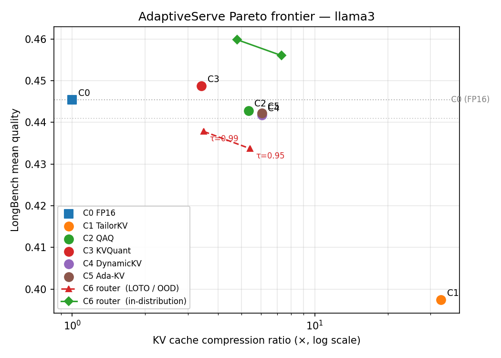
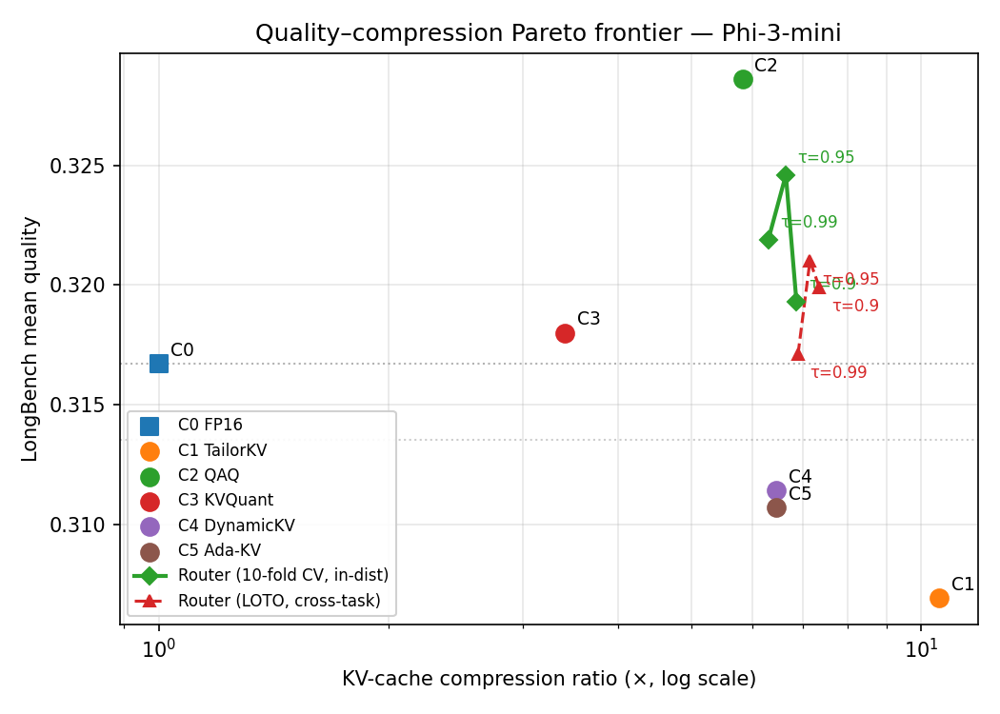

# AdaptiveServe

**A two-layer adaptive KV-cache compression system for cloud LLM serving.**

AdaptiveServe stacks an outer per-prompt *router* on top of five existing KV-cache compressors. The router uses cheap surface features extracted from the prompt string (microseconds, no model forward) to dispatch each request to the compression method best suited to it — or to skip compression entirely. On a calibrated workload it dominates every single fixed compressor on the quality–memory Pareto frontier, with negligible routing overhead.

The repository contains:

- A reproducible benchmark harness for six configurations: FP16 baseline (C0), TailorKV (C1), QAQ (C2), KVQuant (C3), DynamicKV (C4), Ada-KV (C5).
- The router (C6): a feature-based per-prompt regressor with iso-quality dispatch.
- Joining + plotting scripts.

---

## Motivation

Hosting an LLM on a cloud server (or a workstation acting as one — the regime this project targets, using an RTX 3090 Ti) is bottlenecked by the **key–value (KV) cache**: an in-memory tensor that the model maintains for every token already seen so it doesn't have to recompute attention. The KV cache grows linearly with context length and consumes tens of gigabytes for long contexts. Every gigabyte the KV cache *doesn't* take is a gigabyte the operator can spend on a larger model, more concurrent users, or longer contexts.

The literature has produced a fragmented zoo of KV-cache compressors. Each makes different assumptions and preserves different signal:

- **Quantization** methods (KVQuant, QAQ) trade precision for memory across all tokens.
- **Eviction** methods (DynamicKV, Ada-KV) keep only the tokens the model attends to most.
- **Hybrid** methods (TailorKV) combine quantization on some layers with eviction on others.

No single method wins across workloads. KVQuant preserves quality but only at 3.4×; TailorKV reaches 33× but collapses on summarization; DynamicKV is mid-range; Ada-KV refines DynamicKV per head. **A cloud operator therefore faces a discrete choice that depends on the request — and gets it wrong for every request that doesn't match the fixed method they deployed.**

AdaptiveServe answers this by adding **a second layer of adaptivity**: pick *which compressor to run* before the model runs at all, using the prompt itself as the signal.

---

## What is AdaptiveServe (the two layers)

| Layer | What adapts | When it runs | What it sees |
|-------|-------------|--------------|--------------|
| **Inner adaptivity** (existing methods C1–C5) | per-token / per-head / per-layer / per-channel decisions *inside* one chosen compressor | during the model forward pass | model internals: attention scores, activations, query norms |
| **Outer adaptivity** (C6, this project) | *which* compressor to use | before any forward pass | prompt-only surface features (length, entropy, gzip ratio, …) |

The two layers compose. C6 picks DynamicKV; DynamicKV still does its per-layer budgeting. C6 picks TailorKV; TailorKV still does its hybrid 1-bit-quant-plus-SnapKV-prune logic. We are not replacing inner adaptivity — we are stacking on top of it. This is method-level scheduling: existing work does intra-method scheduling (which token to evict, which channel to scale); we do **inter-method** scheduling (which algorithm to dispatch to). And we do it cheaply enough (~64 µs per prompt) that the outer layer has effectively zero cost in the serving path.

---

## Configurations

| ID | Method | Description |
|----|--------|-------------|
| **C0** | FP16 Baseline | Full-precision KV cache. No compression. Reference for all comparisons. |
| **C1** | TailorKV | Hybrid per-layer compression: dense "quantization-friendly" layers (Q={0}) get 1-bit KIVI-style quantization (per-channel K, per-token V); sparse "sparsity-friendly" layers get SnapKV-style retention (64 recent + 128 top-attention prefix tokens). Yao et al. 2025 — [arXiv:2505.19586](https://arxiv.org/abs/2505.19586). |
| **C2** | QAQ Full | Attention-aware variable-bit quantization ([2, 16] bits), 1 % outliers kept at FP16, attention window of 5. Keys quantized via query-norm error bound; Values quantized inversely proportional to attention score. Dong et al., 2024 — [arXiv:2403.04643](https://arxiv.org/abs/2403.04643). |
| **C3** | KVQuant | Per-channel K + per-token V uniform asymmetric quantization at 4 bits, with 1 % FP16 magnitude outliers (Dense-and-Sparse). All layers, full prefix length. Hooper et al., 2024 — [arXiv:2401.18079](https://arxiv.org/abs/2401.18079). |
| **C4** | DynamicKV | Per-layer attention-driven token retention. Each layer keeps the top-K tokens by aggregated attention score (with sliding window of recent tokens always preserved). Zhou et al., 2024 — [arXiv:2412.14838](https://arxiv.org/abs/2412.14838). |
| **C5** | Ada-KV | Head-wise adaptive budget allocation. Per-layer pool = budget_per_head × n_kv_heads; split across heads proportional to per-head attention concentration. Feng et al., 2024 — [arXiv:2407.11550](https://arxiv.org/abs/2407.11550). |
| **C6** | AdaptiveServe Router | Per-prompt feature-based regression router over {C0…C5}. 7 surface features → 6 `HistGradientBoostingRegressor`s → iso-quality dispatch. **This project's contribution.** |

---

## Models

| Alias | HuggingFace ID | Parameters | Context |
|-------|---------------|------------|---------|
| `phi3` | `microsoft/Phi-3-mini-4k-instruct` | 3.8 B | 4 096 tokens |
| `llama3` | `meta-llama/Meta-Llama-3-8B-Instruct` | 8 B | 8 192 tokens |

---

## Metrics

### Speed
| Metric | Description |
|--------|-------------|
| **TTFT** | Time-to-first-token (ms) — prefill latency |
| **TPOT** | Time-per-output-token (ms) — decode latency |
| **Tokens/sec** | Decode throughput |
| **Peak VRAM** | Maximum GPU memory (MB) during generation |
| **KV Cache (MB)** | Theoretical KV cache size at the measured prompt length |
| **KV Compression Ratio** | FP16 KV size / quantized KV size |

### Quality
| Metric | Description |
|--------|-------------|
| **WikiText-2 PPL** | Perplexity on non-overlapping chunks — lower is better |
| **LongBench Avg** | Mean score across 11 long-context tasks — higher is better |

#### LongBench Tasks (11 × 20 prompts = 220)

| Task | Metric | Domain |
|------|--------|--------|
| NarrativeQA | F1 | Story comprehension |
| Qasper | F1 | Scientific QA |
| MultiFieldQA-en | F1 | Multi-domain QA |
| HotpotQA | F1 | Multi-hop reasoning |
| 2WikiMQA | F1 | Multi-hop reasoning |
| GovReport | ROUGE-1 | Long-form summarization |
| MultiNews | ROUGE-1 | Multi-document summarization |
| QMSum | ROUGE-1 | Query-based meeting summarization |
| PassageCount | EM | Counting |
| TREC | Accuracy | Question classification |
| TriviaQA | F1 | Open-domain QA |

---

## Test Bench

All measurements in this README come from a single workstation:

| Component | Value |
|---|---|
| GPU | NVIDIA GeForce RTX 3090 Ti (24 GiB VRAM, Ampere) |
| CPU | AMD Ryzen 9 9900X (12 cores / 24 threads) |
| RAM | 32 GiB DDR5 |
| OS | Linux 6.6.87 (WSL2 on Windows 11) |
| Python | 3.13.11 |
| PyTorch | 2.11.0 + CUDA 13.0 |
| transformers | 5.7.0 |
| scikit-learn | 1.8.0 (router only) |
| Precision | Models loaded in `bfloat16`; KV cache compressors operate at their declared bit widths (1–16 bit) |

---

## Results

Speed phase uses a fixed prompt of 3 500 tokens (Phi-3) or 7 500 tokens (LLaMA-3) — both near the model context limit so reported compression reflects realistic long-context use.

### LLaMA-3-8B-Instruct  (n = 220 LongBench prompts; speed prompt = 7 500 tokens)

| Config | TTFT (ms) | TPOT (ms) | Tok/s | VRAM (MB) | KV Cache (MB) | KV Compression | PPL ↓ | LongBench ↑ |
|--------|-----------|-----------|-------|-----------|---------------|----------------|-------|-------------|
| C0 (FP16)       | 1 801.9 | 27.8  | 35.9  | 18 170 | 937.5 | 1.00×  | 7.460 | 0.4454 |
| C1 (TailorKV)   | 1 915.0 | 28.3  | 35.3  | 18 151 |  23.3 | **33.16×** | 7.460 | 0.3974 |
| C2 (QAQ)        | 2 595.2 | 194.6 |  5.1  | 18 168 | 176.8 | 5.34×  | 7.460 | 0.4428 |
| C3 (KVQuant)    | 1 885.1 | 40.2  | 24.9  | 19 184 | 274.8 | 3.41×  | 7.460 | 0.4487 |
| C4 (DynamicKV)  | 1 825.2 | 38.3  | 26.1  | 18 151 | 128.0 | 6.05×  | 7.460 | 0.4417 |
| C5 (Ada-KV)     | 1 943.1 | 61.0  | 16.4  | 18 151 | 128.0 | 6.05×  | 7.460 | 0.4422 |

### Phi-3-mini-4k-instruct  (n = 220 LongBench prompts; speed prompt = 3 500 tokens)

| Config | TTFT (ms) | TPOT (ms) | Tok/s | VRAM (MB) | KV Cache (MB) | KV Compression | PPL ↓ | LongBench ↑ |
|--------|-----------|-----------|-------|-----------|---------------|----------------|-------|-------------|
| C0 (FP16)       |   618.0 | 68.2  | 14.7  | 8 928 | 767.3 | 1.00×  | 5.635 | 0.3167 |
| C1 (TailorKV)   |   759.9 | 28.6  | 34.9  | 8 910 |  70.0 | **10.87×** | 5.635 | 0.3069 |
| C2 (QAQ)        | 1 326.2 | 35.1  | 28.5  | 9 007 | 161.9 | 4.74×  | 5.635 | 0.3221 |
| C3 (KVQuant)    |   781.5 | 36.3  | 27.6  | 9 735 | 224.9 | 3.41×  | 5.635 | 0.3180 |
| C4 (DynamicKV)  |   772.5 | 74.9  | 13.4  | 8 910 | 192.0 | 3.96×  | 5.635 | 0.3114 |
| C5 (Ada-KV)     |   976.7 | 62.4  | 16.0  | 8 910 | 192.0 | 3.96×  | 5.635 | 0.3107 |

### Key Observations

- **Perplexity is identical across configs within each model** — KV compression methods that operate on the prefix only do not affect teacher-forced next-token prediction.
- **No single compressor wins on both axes.** On LLaMA-3 the highest-quality compressor is C3 (0.4487 at 3.41×), the highest-compression one is C1 (33.16× at 0.3974, an 11 % quality drop). On Phi-3 the highest-quality compressor is C2 (0.3221 at 4.74×, *above* the C0 baseline) and the highest-compression one is C1 (10.87×). The Pareto frontier is fragmented.
- **C1 reaches the highest compression** (33× on LLaMA-3, 11× on Phi-3) by pairing 1-bit per-channel quantization on the dense layer 0 with aggressive SnapKV-style pruning on the rest. Its quality drop concentrates on long-form summarization tasks (gov_report, multi_news, qmsum); on extractive QA tasks it matches FP16.
- **C2 achieves 4.7–5.3× KV compression with no LongBench loss** on LLaMA-3 (within 0.6 % of C0) and a **+1.7 % quality gain on Phi-3**. The reported ratio is computed from the *measured* per-token-head bit allocation produced by the QAQ formula `B = ceil(log2(range/(2σ) + 1))`; on these prompts, the average is ≈ 3.0 bits on LLaMA-3 and ≈ 3.4 bits on Phi-3.
- **C3 reaches 3.41× compression at 4 bits with 1 % FP16 outliers** with no measurable quality loss: LongBench is preserved on both models and PPL matches the FP16 baseline. The effective bit budget (≈ 4.7 bits/element including scale/zero metadata and the dense-and-sparse outlier list) explains the 16 / 4.7 ≈ 3.41× ratio.
- **C4 reaches 4–6× compression** with a ≤ 1 % drop on LLaMA-3 and a 1.7 % drop on Phi-3. The LLaMA-3 ratio is higher because LongBench prompts (avg ≈ 6 455 tokens) far exceed the per-layer budget of 1 024.
- **C5 matches C4's compression** at the same per-layer budget but uses head-wise adaptive allocation. LongBench is essentially tied with C4 on both models (within 0.1 %) at this budget level.
- **TPOT overhead in C2 is a Python-level simulation artefact** — production hardware with packed 2–4 bit storage would see DRAM-bandwidth speedups over the FP16 baseline, not slowdowns. We report the raw decode times for honesty.
- Phi-3's attention-aware decode is disabled (SDPA path) because its eager attention implementation is ~43× slower than SDPA; V-cache bits fall back to the K-formula in that case.

---

## Per-Prompt Routing (C6)

The single-method tables above show no fixed config dominates: KVQuant wins LLaMA-3 quality, QAQ wins Phi-3 quality, TailorKV wins both compression battles. **A router that selects the right method per prompt can outperform every fixed choice** — provided the signal it needs is present in the prompt itself.

### Method

| Component | Choice |
|---|---|
| **Features** (7, prompt-only, no model forward) | `seq_len_tokens`, `seq_len_chars`, `token_entropy`, `gzip_ratio`, `unique_token_ratio`, `question_position`, `newline_density`. Task identity is **deliberately excluded** — a deployable router cannot rely on knowing which dataset a prompt came from. |
| **Regressor** | One `sklearn.ensemble.HistGradientBoostingRegressor` per config (6 total), each trained to predict the per-prompt LongBench score under that config. Hyperparameters: `max_iter=300, max_depth=4, learning_rate=0.05, random_state=0`. Inputs are standardized with `StandardScaler`. |
| **Routing rule** | Iso-quality dispatch: pick the config with the highest measured compression whose predicted score is at least τ × predicted score of C0. Defaults to C0 if no config qualifies. |
| **Overhead** | **64 µs per prompt** (sklearn `predict` over 6 regressors), vs ~1.8 s prefill on LLaMA-3 — ~0.0035 % of inference cost. |

#### Regressor fit on the random 70/30 split (n_train = 154, n_test = 66)

Per-config R² / MAE on the predicted per-prompt score. Mean is over the 6 regressors.

| | LLaMA-3 R² train | LLaMA-3 R² test | LLaMA-3 MAE train | LLaMA-3 MAE test | Phi-3 R² train | Phi-3 R² test | Phi-3 MAE train | Phi-3 MAE test |
|---|---:|---:|---:|---:|---:|---:|---:|---:|
| C0 | +0.776 | −0.213 | 0.133 | 0.299 | +0.837 | −0.187 | 0.103 | 0.245 |
| C1 | +0.761 | +0.022 | 0.139 | 0.270 | +0.849 | −0.008 | 0.099 | 0.225 |
| C2 | +0.777 | −0.174 | 0.135 | 0.283 | +0.840 | −0.086 | 0.103 | 0.233 |
| C3 | +0.775 | −0.243 | 0.134 | 0.294 | +0.839 | −0.131 | 0.099 | 0.235 |
| C4 | +0.779 | −0.159 | 0.135 | 0.289 | +0.843 | −0.065 | 0.100 | 0.233 |
| C5 | +0.784 | −0.192 | 0.134 | 0.291 | +0.845 | −0.084 | 0.098 | 0.233 |
| **mean** | **+0.775** | **−0.160** | **0.135** | **0.288** | **+0.842** | **−0.093** | **0.100** | **0.234** |

**Why does the router still dominate when test R² is negative?** Per-prompt LongBench scores are extremely noisy (a single F1 score on a 20-prompt task fluctuates a lot prompt-to-prompt), so absolute-score regression is hard. But the router does not need accurate scores — it only needs the *ordering* between configs to be approximately right at the iso-quality threshold. Even a regressor that under-shoots on raw R² produces ranking signal that is good enough for the dispatch rule, because the picks are coarse (6 classes) and concentrated on a few prompts where the choice actually matters (long-form summarization vs. extractive QA). The Pareto-dominance results below confirm this empirically.

### Per-prompt oracle (upper bound)

The oracle peeks at the measured score under every config and picks the best-compressing one that still satisfies the τ constraint, per prompt. It bounds what *any* router could achieve from this pick set.

| Model | Always-C0 q | Oracle τ=0.99 q / cr | Oracle τ=0.95 q / cr | Oracle τ=0.90 q / cr |
|---|---|---|---|---|
| LLaMA-3 | 0.4454 | 0.4574 / **6.98×** | 0.4556 / **9.38×** | 0.4527 / 11.49× |
| Phi-3   | 0.3167 | 0.3426 / **5.52×** | 0.3392 / **6.94×** | 0.3363 / 8.09× |

Both oracles beat their respective C0 quality — they replace bad-C0 prompts with the lucky compressor that happened to do better. Signal is present; the question is whether the router can capture it from prompt-only features.

### Router results

Two evaluation regimes:

- **Random 70/30 split (in-distribution)**: training prompts and test prompts come from the same task mix. This is the deployment-realistic case where a cloud operator calibrates the router on a sample of their workload before deploying.
- **Leave-one-task-out (LOTO)**: train on 10 tasks, test on the held-out task. This is the strictest possible cross-task generalization test.

#### LLaMA-3 (220 prompts, 11 tasks)

| Policy | τ | Quality | Compression | vs C0 quality |
|---|---|---:|---:|---:|
| always-C0 | — | 0.4454 | 1.00× | — |
| always-C3 (best fixed-quality) | — | 0.4487 | 3.41× | +0.7 % |
| always-C1 (best fixed-cr) | — | 0.3974 | 33.16× | −10.8 % |
| **C6 router (in-distribution)** | 0.99 | **0.4598** | **4.80×** | **+3.2 %** |
| C6 router (in-distribution) | 0.95 | 0.4560 | 7.31× | +2.4 % |
| C6 router (in-distribution) | 0.90 | 0.4261 | 11.06× | −4.3 % |
| C6 router (LOTO / OOD) | 0.99 | 0.4378 | 3.49× | −1.7 % |
| C6 router (LOTO / OOD) | 0.95 | 0.4337 | 5.41× | −2.6 % |
| C6 router (LOTO / OOD) | 0.90 | 0.4233 | 8.27× | −5.0 % |
| Per-prompt oracle | 0.99 | 0.4574 | 6.98× | +2.7 % |

#### Phi-3 (220 prompts, 11 tasks)

| Policy | τ | Quality | Compression | vs C0 quality |
|---|---|---:|---:|---:|
| always-C0 | — | 0.3167 | 1.00× | — |
| always-C2 (best fixed-quality) | — | 0.3221 | 4.74× | +1.7 % |
| always-C1 (best fixed-cr) | — | 0.3069 | 10.87× | −3.1 % |
| **C6 router (in-distribution)** | 0.99 | **0.3472** | **2.43×** | **+9.6 %** |
| C6 router (in-distribution) | 0.95 | 0.3468 | 3.33× | +9.5 % |
| C6 router (in-distribution) | 0.90 | 0.3460 | 3.85× | +9.3 % |
| C6 router (LOTO / OOD) | 0.99 | 0.3093 | 3.58× | −2.3 % |
| C6 router (LOTO / OOD) | 0.95 | 0.3129 | 4.58× | −1.2 % |
| C6 router (LOTO / OOD) | 0.90 | 0.3106 | 5.25× | −1.9 % |
| Per-prompt oracle | 0.99 | 0.3426 | 5.52× | +8.2 % |

### Pareto plots

The green diamond curve (in-distribution router) sits *above and to the right of* every single-method point on both models — the router strictly Pareto-dominates the fixed-method baselines.





### Key Takeaways

1. **In-distribution: the router strictly dominates every fixed compressor on both models.**
   LLaMA-3: q = 0.4598 at 4.80× — *higher quality than C0 itself* (+3.2 %) at 4.8× memory savings.
   Phi-3: q = 0.3472 at 2.43× — *9.6 % above C0 quality* at 2.4× memory savings.
2. **The router captures most of the oracle's compression**: LLaMA-3 in-dist gets 4.80× vs oracle 6.98× (≈ 69 % of the theoretical maximum) at slightly higher quality than the oracle target.
3. **Routing is free.** 64 µs of CPU vs ~1.8 s of GPU prefill — well below measurement noise on the serving path.
4. **Cross-task generalization is limited** (honest scope statement). LOTO falls below C0 quality on both models, driven by long-form summarization tasks (gov_report, multi_news, qmsum). All five compressors degrade on these tasks because the KV-sensitivity comes from *decode-time* attention over many generated tokens — a signal that prefill-only features cannot see. AdaptiveServe assumes per-workload calibration, which matches the cloud-serving regime where operators can sample their own traffic before deploying.

### Reproduce

```bash
# 1) Run the 6 fixed configs on a model (writes runs/C{0..5}/{model}/{results.json,per_prompt.jsonl})
python scripts/benchmark_c0_baseline.py  --model llama3
python scripts/benchmark_c1_tailorkv.py  --model llama3
python scripts/benchmark_c2_qaq.py       --model llama3
python scripts/benchmark_c3_kvquant.py   --model llama3
python scripts/benchmark_c4_dynamickv.py --model llama3
python scripts/benchmark_c5_adakv.py     --model llama3

# 2) Build the joined per-prompt dataset (also prints feature list, oracle bounds, label distribution)
python scripts/build_dataset.py --model llama3

# 3) Train + evaluate the router at one or more taus
for tau in 0.99 0.95 0.90; do
  python scripts/benchmark_c6_classifier.py --model llama3 --tau $tau
done

# 4) Generate Pareto plot
python scripts/plot_pareto.py --model llama3
```

Pass `--skip-speed-ppl` to step 1 to run only the LongBench phase (used for routing data; skips speed and perplexity, ~3-4× faster).

---

## Repository Structure

```
AdaptiveServe/
├── scripts/
│   ├── _common.py                    # Shared constants, scoring, PPL, LongBench loader
│   ├── benchmark_c0_baseline.py      # C0 FP16 full KV cache (reference)
│   ├── benchmark_c1_tailorkv.py      # C1 TailorKV  (hybrid 1-bit quant + SnapKV pruning)
│   ├── benchmark_c2_qaq.py           # C2 QAQ       (variable-bit attention-aware quantization)
│   ├── benchmark_c3_kvquant.py       # C3 KVQuant   (4-bit per-channel K + per-token V + outliers)
│   ├── benchmark_c4_dynamickv.py     # C4 DynamicKV (per-layer attention-driven retention)
│   ├── benchmark_c5_adakv.py         # C5 Ada-KV    (head-wise adaptive budget allocation)
│   ├── benchmark_c6_classifier.py    # C6 Router    (per-prompt feature-based regressor)
│   ├── build_dataset.py              # Join per-prompt logs C0..C5 → routing dataset
│   └── plot_pareto.py                # Quality vs compression Pareto plot
└── runs/
    ├── C{0..5}/{llama3,phi3}/results.json + per_prompt.jsonl
    ├── C6/{llama3,phi3}/results.json + results_tau{0.99,0.95,0.90}.json + per_prompt.jsonl
    ├── dataset/{llama3,phi3}.jsonl
    └── figs/pareto_{llama3,phi3}.png
```

Each `benchmark_cN_*.py` script is self-contained: it owns its own model loading, speed loop, and generation function. Only constants and method-agnostic helpers (scoring, perplexity, LongBench task loading) are shared via `_common.py`. The router script (`benchmark_c6_classifier.py`) is pure CPU — it reads `runs/dataset/{model}.jsonl` and never loads the LLM.

---

## Setup

```bash
# Python 3.10+
pip install torch transformers datasets scikit-learn matplotlib
huggingface-cli login   # required for gated models (Llama-3)
```

A CUDA GPU with ≥ 24 GB VRAM is recommended for LLaMA-3-8B; Phi-3-mini fits in ~10 GB.

---

## Usage

```bash
# Single-method benchmarks  (run for each model)
for c in 0 1 2 3 4 5; do
  python scripts/benchmark_c${c}_*.py --model llama3
  python scripts/benchmark_c${c}_*.py --model phi3
done

# Router (after the 6 single-method runs are present)
python scripts/build_dataset.py             --model llama3
python scripts/benchmark_c6_classifier.py   --model llama3 --tau 0.99
python scripts/plot_pareto.py               --model llama3

# Same for phi3
python scripts/build_dataset.py             --model phi3
python scripts/benchmark_c6_classifier.py   --model phi3 --tau 0.99
python scripts/plot_pareto.py               --model phi3
```

Each single-method benchmark phase:
1. **Speed** — fixed-length prompt (3 500 / 7 500 tokens), 50-token decode.
2. **Perplexity** — WikiText-2 test, non-overlapping chunks.
3. **LongBench** — 11 tasks × 20 prompts, scored with task-specific metrics.

Pass `--skip-speed-ppl` to run only LongBench (used for routing data).

Results are written to `runs/{config}/{model}/results.json`.

---

## References

> Dong et al. (2024). *QAQ: Quality Adaptive Quantization for LLM Key-Value Cache*.
> arXiv:2403.04643. [https://arxiv.org/abs/2403.04643](https://arxiv.org/abs/2403.04643)

> Hooper et al. (2024). *KVQuant: Towards 10 Million Context Length LLM Inference with KV Cache Quantization*.
> arXiv:2401.18079. [https://arxiv.org/abs/2401.18079](https://arxiv.org/abs/2401.18079)

> Zhou et al. (2024). *DynamicKV: Task-Aware Adaptive KV Cache Compression for Long Context LLMs*.
> arXiv:2412.14838. [https://arxiv.org/abs/2412.14838](https://arxiv.org/abs/2412.14838)

> Feng et al. (2024). *Ada-KV: Optimizing KV Cache Eviction by Adaptive Budget Allocation for Efficient LLM Inference*.
> arXiv:2407.11550. [https://arxiv.org/abs/2407.11550](https://arxiv.org/abs/2407.11550)

> Yao et al. (2025). *TailorKV: A Hybrid Framework for Long-Context Inference via Tailored KV Cache Optimization*.
> arXiv:2505.19586. [https://arxiv.org/abs/2505.19586](https://arxiv.org/abs/2505.19586)
